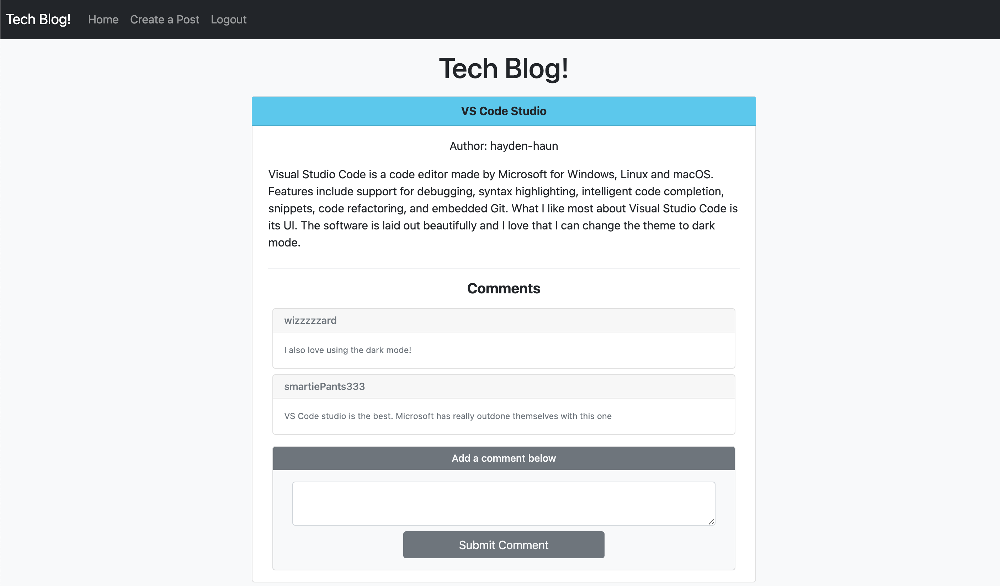

# Tech-Blog

LIVE URL: https://tech-blog-hh.herokuapp.com/

REPOSITORY: https://github.com/Hayden-Haun/Tech-Blog

## Table of Contents

- [Description](#description)
- [Installation](#installation)
- [Contributions](#contributions)
- [Usage](#usage)
- [Tests](#tests)
- [Technologies Used](#Technologies)
- [Credits](#credits)
- [Questions](#questions)

## Description

    This is a social media application to discuss technology! Before creating an account or logging in, you can view existing blog posts and their comments. Once you login, you can create a new blog post and comment on other posts.

## Installation

    npm i

## Contributions

    Contact the owner

## Usage

    Launch Server: node server.js Seed Database: npm run seed

## Tests

    none

## Technologies Used

    Handlebars, Javascript, mySql, Sequelize, Express.js, bcrypt, User Authentication, req.sessions Node.JS, JAWS_DB, Heroku

## Credits

    Hayden Haun

## Questions

    For additional questions, please contact GitHub user Hayden-Haun at haydenhaun@gmail.com
